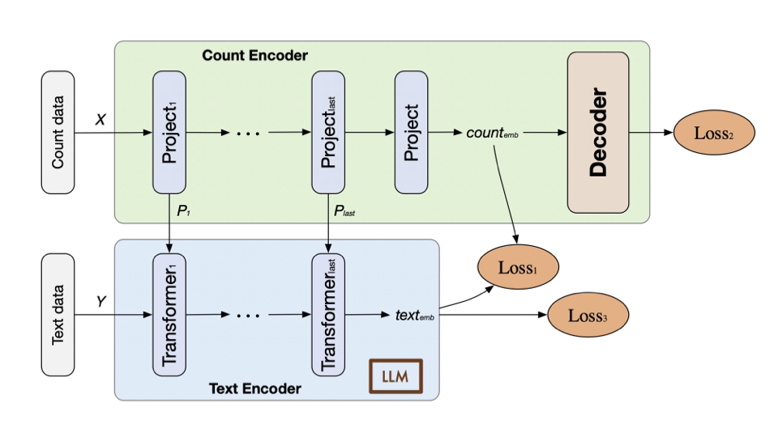

## Overview
we present a prompt-leaning framework that integrates gene expression data into large language models (LLMs) to generate low-dimensional cell embeddings, called scPT. By generating prompts from gene expression profiles and putting them into transformer layers, scPT enhances the LLM embeddings, effectively fusing expression and text identity information.



## Requirements
* Python==3.10

## Installation
Start by following this source codes:
```bash
conda create -n scPT python=3.10
pip install -r requirements.txt
```

## Data availability
All the data can be found in the supplementary materials of the article.


## Tutorial
* You can download the nomic-ai from https://huggingface.co/nomic-ai/nomic-embed-text-v2-moe/tree/main.
* Use `train.py` to train the model, then you can obtain the data embeddings and model parameters.
* We use `result.py` to perform the final result analysis for all methods, the results of the spatial data can be found in the `spatial` folder.
